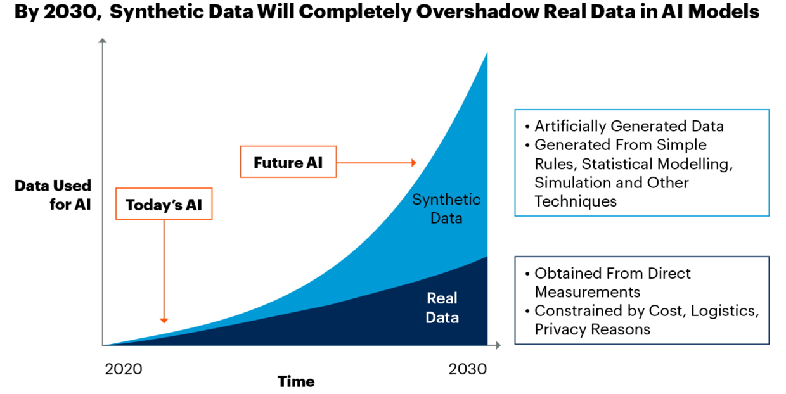

# UCLA Synthetic Data Workshop

**April 13th - 14th**

We are pleased to announce the UCLA synthetic data workshop. This 2-day workshop is hosted by the UCLA Department of Statistics and co-sponsored by [IDRE](https://idre.ucla.edu/) and [UCLA-Amazon Science Hub](https://www.sciencehub.ucla.edu/). The workshop is being held at the [UCLA Faculty Club](https://facultyclub.ucla.edu/). Virtual Link TBD.

### About
Synthetic data generation is a rapidly growing and highly disciplinary research area that
draws much attention from both academia and industry. For the development of algorithmic
procedures for fraud detection and spam identification, as well as for the construction of AIdriven
models in industries like manufacturing and supply chain management, synthetic data
has become a valuable resource. The advantages of synthetic data include cost savings, increased
speed, agility, increased intelligence, and cutting-edge privacy. According to the Gartner report,
synthetic data will overshadow real data in training machine/deep learning models by 2030; see
Figure 1. Additionally, the MIT Technology Review named synthetic data as one of its top 10
game-changing innovations for 2022 earlier this year. Therefore, it is believed that synthetic
data generation will be an indispensable part of the next-generation machine learning workflow.

<!-- 

-->

Despite numerous successful applications of synthetic data, its scientific foundation, e.g., the
tradeoff among fidelity, utility, and privacy, is still missing. Additionally, industrial standards
for generating and utilizing synthetic data are not fully developed. Furthermore, the privacy law
concerning about synthetic data has not been fully developed. Therefore, one goal of the proposed
“UCLA Synthetic Data Workshop” is to form a community of synthetic data researchers,
policymakers, and industrial partners. Another purpose is to facilitate data-centric Machine
Learning research by bringing together investigators in generative models and trustworthy AI
(privacy, fairness, and robustness) to collaborate on the development of the theory, methodology, 
and algorithms needed to produce synthetic benchmark datasets and algorithms. This workshop is highly 
interdisciplinary and brings together research communities in statistics, computer science, mathematics 
and law as well as industry leaders.

### Speakers
Confirmed speakers at the workshop include:
- TBD

### Program

### Poster

### Travel Award

### Organizers
- [Guang Cheng](http://www.stat.ucla.edu/~guangcheng/)
- [Hongquan Xu](http://www.stat.ucla.edu/~hqxu/)
- [Jerry Reiter](https://www2.stat.duke.edu/~jerry/)
- [Mark Mckenna](https://law.ucla.edu/faculty/faculty-profiles/mark-mckenna)
- [Xiaowu Dai](https://www.xiaowudai.org/)
- [Ying Nian Wu](https://www.xiaowudai.org/)

<!-- 
### Registration

Registration Rates:
- $30 - Student
- $50 - Postdoc, Faculty, Professional

[Click here](https://uclahs.az1.qualtrics.com/jfe/form/SV_8bJEdJEKUs53aCy) to register for the February 3, 2023 Lange Symposium. 

The registration deadline is **January 6, 2023**.
-->

<!-- 
### Diversity Travel Awards

We are offering travel awards for attendees who will further the goal of increasing the diversity of the synthetic data  workforce. This includes persons from underrepresented groups (i.e., racial and ethnic minorities, first-generation college students, and persons with disabilities). You may also apply if you are faculty from an advanced degree granting institution with a high enrollment of underrepresented minority students, who would be interested in partnering with UCLA faculty to make symposium and workshop material available to their students. 

Travel awards will cover travel within the U.S., meals, and lodging.

[Click here](TBD) to apply for a Travel Award for the February 3, 2023 Lange Symposium. 

The travel award application deadline is **TBD**. Results will be announced December 16 2022.
-->

### Accommodation

If you need accommodation, nearby options include the following local hotels.

- [UCLA Meyer & Renee Luskin Conference Center](https://luskinconferencecenter.ucla.edu/hotels-near-ucla/standard-rooms/)
(Location of the symposium.)

- [UCLA Guest House](http://guesthouse.ucla.edu/)

- [Palihotel Westwood Village](https://www.palisociety.com/hotels/westwood-village)

- [Royal Palace Westwood](http://www.royalpalacewestwood.com/)

- [W Los Angeles Westwood](https://www.marriott.com/en-us/hotels/laxwb-w-los-angeles-west-beverly-hills/overview/)

### Contact

For more information contact [Prof. Guang Cheng](guangcheng@ucla.edu).

<!-- ### Past Events
- [2020 Inaugural Lange Symposium](https://langesymposium.github.io/2020/)
- [2022 July Lange Symposium Workshop](https://langesymposium.github.io/2022-July-Workshop/)
- [2022 October Lange Symposium](https://langesymposium.github.io/2022-October-Symposium/) -->
